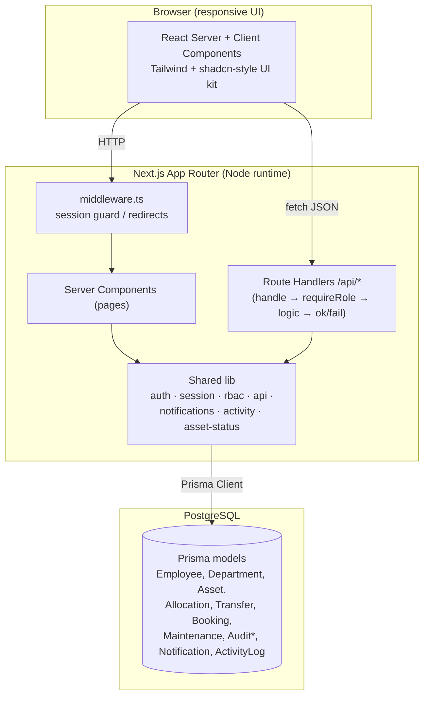
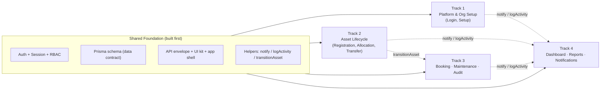
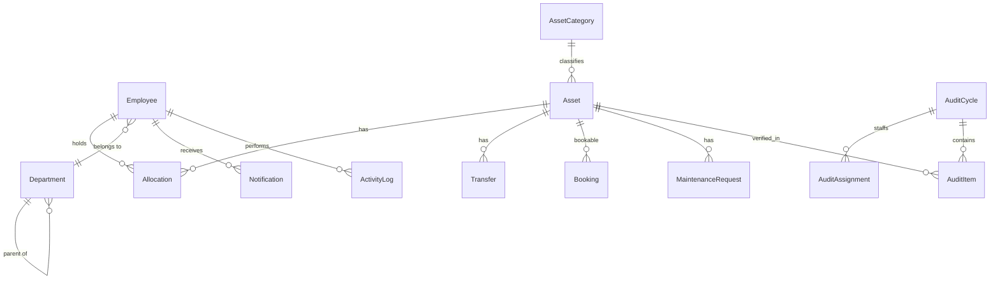
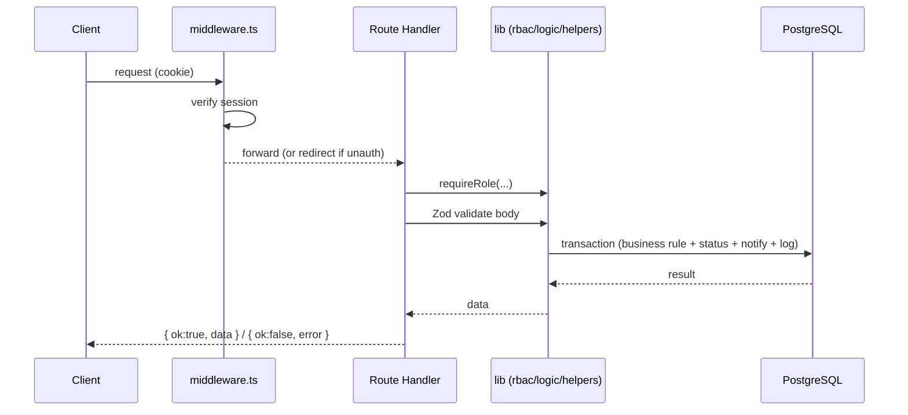

# High-Level Design (HLD)

**Project:** AssetFlow — Enterprise Asset & Resource Management System
**Version:** 1.0
**Date:** 2026-07-12
**Companion docs:** [SRS.md](./SRS.md), [LLD.md](./LLD.md)

---

## 1. Architecture Overview

AssetFlow is a **monolithic full-stack Next.js application** using the App Router. The same deployment serves server-rendered UI and JSON API route handlers, backed by a single PostgreSQL database accessed through Prisma. Authentication is stateless (signed JWT in an httpOnly cookie); authorization is enforced server-side on every protected route.

## 2. Technology Stack

| Layer | Choice | Rationale |
|-------|--------|-----------|
| Framework | Next.js (App Router) + React 19 | One codebase for UI + API; server components reduce client JS. |
| Language | TypeScript (strict) | Type safety across the shared data contract. |
| Database | PostgreSQL | Relational integrity for the entity-heavy domain. |
| ORM | Prisma | Declarative schema = single source of truth; typed client; migrations + seed. |
| Auth | Custom JWT (`jose`) + bcrypt | Full control over the exact role rules; no self-elevation. |
| Styling | Tailwind CSS + shadcn-style components | Consistent look across 4 developers; fast to build. |
| Validation | Zod | Runtime validation of API inputs at the boundary. |

## 3. Module Decomposition (4 parallel tracks)

The system is split into four vertical modules, each owning its screens end-to-end (DB queries → API → UI) over a shared foundation.

| Track | Modules owned | Key server logic |
|-------|---------------|------------------|
| **1 · Platform & Org Setup** | Auth, Departments, Categories, Employee Directory + role promotion, app shell | Session issuance, RBAC, master-data CRUD |
| **2 · Asset Lifecycle** | Asset registration/directory, Allocation, Transfer, Return | Tag generation, conflict rule, `transitionAsset`, overdue flagging |
| **3 · Booking / Maintenance / Audit** | Bookings, Maintenance workflow, Audit cycles | Overlap validation, approval state machines, discrepancy generation |
| **4 · Insight** | Dashboard KPIs, Reports, Notifications & Activity feed | Aggregation queries, read side of notifications/activity |

## 4. Cross-Cutting Concerns

- **Authentication flow:** `login` verifies bcrypt hash → signs JWT → sets `af_session` httpOnly cookie. `middleware.ts` redirects unauthenticated users to `/login` and authenticated users away from auth pages. Server components read the session via `getSession()`.
- **Authorization:** `requireRole(...roles)` / `requireAuth()` at the top of every protected route handler; `hasRole()` for conditional UI (e.g. nav filtering). Enforced **server-side** — the client never decides access.
- **Notifications & activity:** every track calls `notify()` / `notifyMany()` and `logActivity()` rather than writing those tables directly, so Track 4 owns the read side without coupling.
- **Asset status:** all status changes route through `transitionAsset()`, which validates the transition against the lifecycle state machine and logs it. This is the single writer that keeps Tracks 2 and 3 from racing.
- **Error handling:** the `handle()` wrapper converts `AuthError` → 401/403 and `ZodError` → 422, and returns a uniform envelope.

## 5. Data Architecture (high level)

Full field-level schema, enums, and indexes are in [LLD.md](./LLD.md) §2 and `prisma/schema.prisma`.

## 6. Request Lifecycle (representative mutation)

## 7. Deployment View

- **Build:** `next build` produces the server bundle + static assets; Prisma client generated at build time.
- **Runtime:** single Node process (Next server) + PostgreSQL. Horizontally scalable — sessions are stateless (JWT), so no sticky sessions required.
- **Config:** environment-driven (`DATABASE_URL`, `JWT_SECRET`). No secrets in the repo (`.env.example` only).
- **Environments:** each developer runs a local/cloud Postgres; a shared staging DB for integration.

## 8. Key Design Decisions & Trade-offs

| Decision | Alternative | Why chosen |
|----------|-------------|------------|
| Monolith (Next API routes) | Separate backend service | Faster for a 4-person hackathon; one deploy, shared types. |
| Custom JWT auth | NextAuth/Auth.js | Exact control over admin-only role assignment and no self-elevation. |
| Single shared Prisma schema | Per-module schemas | Enforces one data contract; avoids drift between tracks. |
| Centralized `transitionAsset` | Each track updates status | Prevents three tracks racing on `asset.status`. |
| Vertical slices per track | Horizontal layers (all-UI / all-API) | Lets 4 devs work without stepping on each other. |

## 9. Non-Functional Realization

- **Security:** server-side RBAC, bcrypt, signed httpOnly cookies, Zod input validation.
- **Integrity:** DB transactions for multi-step flows; unique constraints (asset tag, category name, cycle+asset); overlap and conflict checks in business logic.
- **Performance:** indexes on `Asset.status`, `Asset.categoryId`, `Booking(assetId,startTime,endTime)`, `Allocation.expectedReturnDate`.
- **Observability:** activity log as an application-level audit trail.

---

*End of HLD. Detailed schemas, state machines, API contracts, and algorithms in [LLD.md](./LLD.md).*
