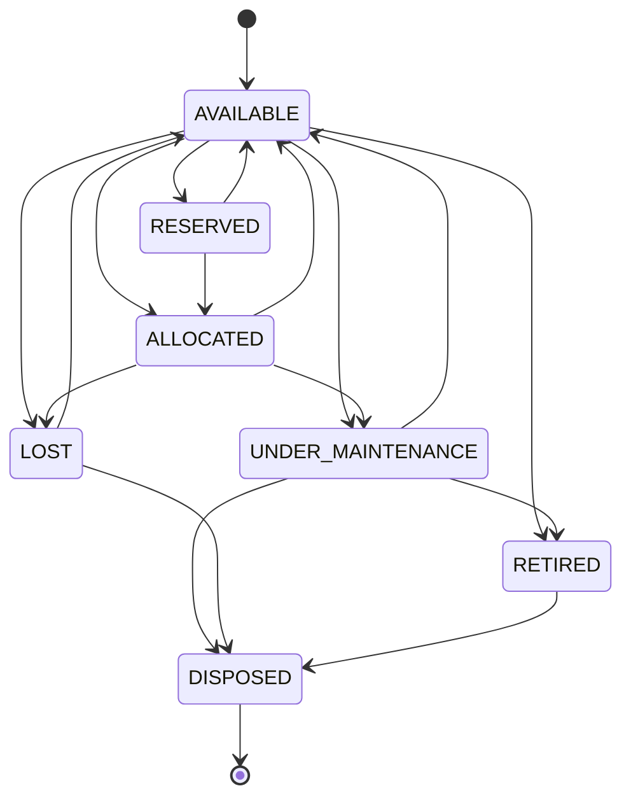
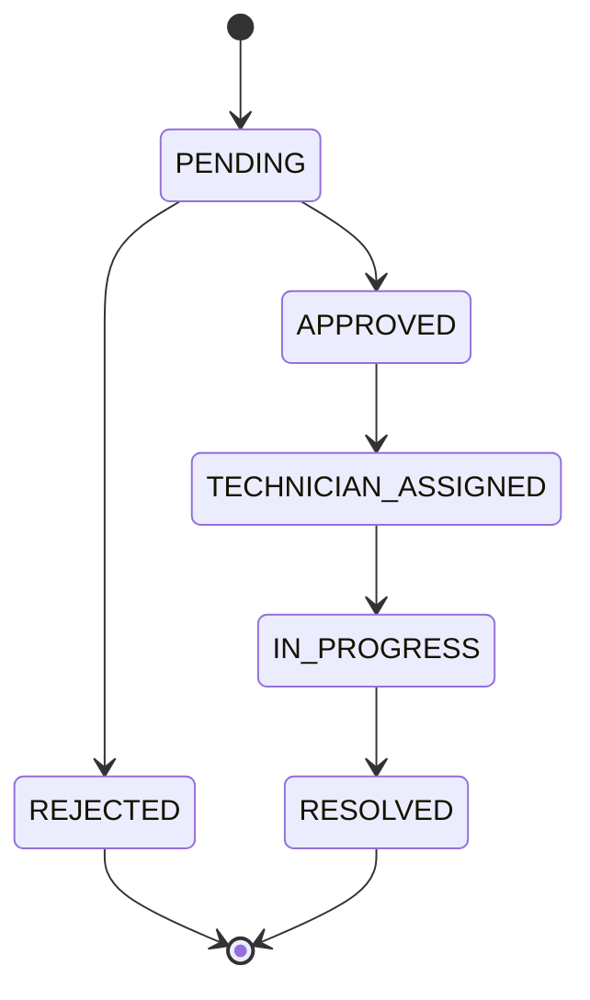

# Low-Level Design (LLD)

**Project:** AssetFlow — Enterprise Asset & Resource Management System
**Version:** 1.0
**Date:** 2026-07-12
**Companion docs:** [SRS.md](./SRS.md), [HLD.md](./HLD.md)

This document is the implementation-level reference: data model, state machines, API contracts, algorithms, and module layout. It mirrors `prisma/schema.prisma` and `src/`.

---

## 1. Project Structure

```
src/
├── middleware.ts                  # session guard + public/private redirects
├── app/
│   ├── layout.tsx  page.tsx  globals.css
│   ├── (auth)/login  (auth)/signup          # Track 1
│   ├── (app)/layout.tsx                      # authed shell, role-filtered nav
│   ├── (app)/dashboard  reports  notifications   # Track 4
│   ├── (app)/setup                           # Track 1
│   ├── (app)/assets  allocations             # Track 2
│   ├── (app)/bookings  maintenance  audits   # Track 3
│   └── api/auth/{login,signup,logout}/route.ts
├── components/ui/{button,input,card}.tsx     # shadcn-style kit
└── lib/
    ├── db.ts            # Prisma singleton
    ├── auth.ts          # hash/verify, signSession/verifySession
    ├── session.ts       # cookie get/set/clear
    ├── rbac.ts          # requireRole / requireAuth / hasRole / AuthError
    ├── api.ts           # handle() wrapper + ok()/fail()
    ├── notifications.ts # notify() / notifyMany()
    ├── activity.ts      # logActivity()
    ├── asset-status.ts  # transitionAsset() + state machine
    └── utils.ts         # cn(), formatAssetTag()
```

---

## 2. Data Model

### 2.1 Enums
| Enum | Values |
|------|--------|
| `Role` | ADMIN, ASSET_MANAGER, DEPARTMENT_HEAD, EMPLOYEE |
| `ActiveStatus` | ACTIVE, INACTIVE |
| `AssetStatus` | AVAILABLE, ALLOCATED, RESERVED, UNDER_MAINTENANCE, LOST, RETIRED, DISPOSED |
| `AllocationStatus` | ACTIVE, RETURNED |
| `TransferStatus` | REQUESTED, APPROVED, REJECTED, COMPLETED |
| `BookingStatus` | UPCOMING, ONGOING, COMPLETED, CANCELLED |
| `MaintenancePriority` | LOW, MEDIUM, HIGH |
| `MaintenanceStatus` | PENDING, APPROVED, REJECTED, TECHNICIAN_ASSIGNED, IN_PROGRESS, RESOLVED |
| `AuditCycleStatus` | OPEN, CLOSED |
| `AuditResult` | PENDING, VERIFIED, MISSING, DAMAGED |

### 2.2 Core tables (selected fields; see schema for full relations)

**Employee** — `id`, `name`, `email` (unique), `passwordHash`, `role` (default EMPLOYEE), `status`, `departmentId?`. Back-relations to allocations, transfers, bookings, maintenance, audits, notifications, logs.

**Department** — `id`, `name`, `status`, `headId?` → Employee, `parentId?` → Department (self-hierarchy), `children[]`.

**AssetCategory** — `id`, `name` (unique), `status`, `customFields` (JSON — array of field definitions, e.g. `[{key,label,type}]`).

**Asset** — `id`, `assetTag` (unique, `AF-####`), `name`, `serialNumber?`, `categoryId`, `acquisitionDate?`, `acquisitionCost?` (Decimal, reporting only), `condition?`, `location?`, `photoUrl?`, `documentsUrl?`, `isBookable` (default false), `status` (default AVAILABLE), `customValues` (JSON keyed to category fields). Indexes: `status`, `categoryId`.

**Allocation** — `id`, `assetId`, `holderId?` (Employee) / `departmentId?`, `allocatedById`, `allocatedAt`, `expectedReturnDate?`, `returnedAt?`, `checkInCondition?`, `checkInNotes?`, `status`. Indexes: `assetId`, `status`, `expectedReturnDate`.

**Transfer** — `id`, `assetId`, `fromEmployeeId?`, `toEmployeeId`, `requestedById`, `approvedById?`, `status`, `reason?`.

**Booking** — `id`, `assetId`, `bookedById`, `departmentId?`, `startTime`, `endTime`, `purpose?`, `status`. Index: `(assetId, startTime, endTime)` for overlap queries.

**MaintenanceRequest** — `id`, `assetId`, `raisedById`, `description`, `priority`, `photoUrl?`, `status`, `approvedById?`, `technicianId?`, `resolutionNotes?`, `resolvedAt?`.

**AuditCycle** — `id`, `name`, `status`, `scopeDepartmentId?`, `scopeLocation?`, `startDate`, `endDate`, `createdById`, `closedAt?`. **AuditAssignment** — `(cycleId, auditorId)` unique. **AuditItem** — `(cycleId, assetId)` unique, `result`, `auditorId?`, `notes?`, `checkedAt?`.

**Notification** — `id`, `userId`, `type`, `title`, `message`, `linkUrl?`, `isRead`. Index `(userId, isRead)`.

**ActivityLog** — `id`, `actorId?`, `action`, `entityType`, `entityId?`, `metadata` (JSON). Indexes `(entityType, entityId)`, `createdAt`.

---

## 3. State Machines

### 3.1 Asset lifecycle (enforced by `transitionAsset`)

Any transition not in this graph throws `InvalidTransitionError`. The allowed map lives in `src/lib/asset-status.ts`.

### 3.2 Maintenance request

Side effects: `APPROVED` → `transitionAsset(assetId, UNDER_MAINTENANCE)`; `RESOLVED` → `transitionAsset(assetId, AVAILABLE)`.

### 3.3 Transfer
`REQUESTED → APPROVED → COMPLETED` (re-allocate), or `REQUESTED → REJECTED`. On COMPLETED: close the current Allocation, create a new one for `toEmployee`, log + notify.

### 3.4 Booking
`UPCOMING → ONGOING → COMPLETED`, or `UPCOMING/ONGOING → CANCELLED`. Status is derived from `now` vs `startTime/endTime` (a scheduled sweep or on-read computation updates it).

### 3.5 Audit cycle
`OPEN → CLOSED`. On close: items still `PENDING` may be treated per policy; `MISSING` → asset `LOST`; `DAMAGED` → flagged (optionally routed to maintenance). Cycle becomes immutable.

---

## 4. API Contract

All endpoints return the envelope `{ ok: true, data } | { ok: false, error, details? }` via `handle()/ok()/fail()`. Auth column = required role(s).

### 4.1 Implemented (foundation)
| Method | Path | Auth | Body → Result |
|--------|------|------|---------------|
| POST | `/api/auth/signup` | public | `{name,email,password}` → creates EMPLOYEE, sets session |
| POST | `/api/auth/login` | public | `{email,password}` → sets session |
| POST | `/api/auth/logout` | any | — → clears session |

### 4.2 To build (per track — recommended contracts)

**Track 1 — Org Setup**
| Method | Path | Auth |
|--------|------|------|
| GET/POST | `/api/departments` | GET: any · POST: ADMIN |
| PATCH/DELETE | `/api/departments/:id` | ADMIN |
| GET/POST | `/api/categories` | GET: any · POST: ADMIN |
| GET | `/api/employees` | ADMIN |
| PATCH | `/api/employees/:id/role` | ADMIN (promote/demote) |
| PATCH | `/api/employees/:id/status` | ADMIN |

**Track 2 — Assets**
| Method | Path | Auth |
|--------|------|------|
| GET | `/api/assets?tag=&serial=&category=&status=&dept=&location=` | any |
| POST | `/api/assets` | ASSET_MANAGER |
| GET | `/api/assets/:id` (incl. allocation + maintenance history) | any |
| POST | `/api/allocations` | ASSET_MANAGER / DEPARTMENT_HEAD |
| POST | `/api/allocations/:id/return` | ASSET_MANAGER |
| POST | `/api/transfers` (request) | any (holder) |
| PATCH | `/api/transfers/:id` (approve/reject) | ASSET_MANAGER / DEPARTMENT_HEAD |

**Track 3 — Booking / Maintenance / Audit**
| Method | Path | Auth |
|--------|------|------|
| GET/POST | `/api/bookings?assetId=` | any (POST validates overlap) |
| PATCH | `/api/bookings/:id` (cancel/reschedule) | owner / DEPARTMENT_HEAD |
| POST | `/api/maintenance` | any |
| PATCH | `/api/maintenance/:id` (approve/reject/assign/progress/resolve) | ASSET_MANAGER |
| POST | `/api/audits` (create cycle) | ADMIN |
| POST | `/api/audits/:id/auditors` | ADMIN |
| PATCH | `/api/audits/:id/items/:assetId` (mark result) | assigned auditor |
| POST | `/api/audits/:id/close` | ADMIN |

**Track 4 — Insight**
| Method | Path | Auth |
|--------|------|------|
| GET | `/api/dashboard/kpis` | any (scoped by role) |
| GET | `/api/reports/:type` (+ `?export=csv`) | ADMIN / ASSET_MANAGER / DEPARTMENT_HEAD |
| GET | `/api/notifications` · PATCH `/:id/read` | any (own) |

### 4.3 Example response
```json
// 200 OK
{ "ok": true, "data": { "id": "clx...", "assetTag": "AF-0001", "status": "ALLOCATED" } }
// 409 Conflict (allocation blocked)
{ "ok": false, "error": "Asset currently held by Priya Patel", "details": { "holderId": "clx..." } }
```

---

## 5. Key Algorithms

### 5.1 Asset Tag generation (`AF-####`)
On registration, compute the next sequence number and format with `formatAssetTag(n)`. To stay unique under concurrency, wrap in a transaction and derive the max existing tag (or use a dedicated counter row / DB sequence):
```
tx:
  last = SELECT assetTag ORDER BY assetTag DESC LIMIT 1   // or a counter table
  n    = parseInt(last.slice(3)) + 1                       // "AF-0007" -> 8
  tag  = formatAssetTag(n)                                 // "AF-0008"
  INSERT asset { assetTag: tag, status: AVAILABLE, ... }
```
The `assetTag` unique constraint is the backstop; retry on collision.

### 5.2 Allocation conflict rule (FR-5.2)
```
POST /api/allocations { assetId, holderId?, departmentId?, expectedReturnDate? }
  active = SELECT Allocation WHERE assetId AND status=ACTIVE
  if active exists:
      return 409 { error: "currently held by <name>", details:{ holderId } }   // offer Transfer
  tx:
      create Allocation(status=ACTIVE)
      transitionAsset(assetId, ALLOCATED)
      notify(holder, "ASSET_ASSIGNED"); logActivity(actor, "ASSET_ALLOCATED", ...)
```

### 5.3 Booking overlap validation (FR-6.2)
Two ranges overlap iff `newStart < existingEnd AND newEnd > existingStart`. Adjacent slots (`end == start`) do **not** overlap, so they are allowed.
```
conflict = SELECT 1 FROM Booking
  WHERE assetId = :assetId
    AND status IN (UPCOMING, ONGOING)
    AND startTime < :newEnd
    AND endTime   > :newStart
  LIMIT 1
if conflict: return 409 "overlaps an existing booking"
```
| Existing 9:00–10:00 | Request | Result |
|---|---|---|
| | 9:30–10:30 | rejected (9:30<10:00 ∧ 10:30>9:00) |
| | 10:00–11:00 | allowed (10:00 !< 10:00) |

### 5.4 Overdue detection (FR-5.5)
```
overdue = SELECT Allocation
  WHERE status = ACTIVE AND expectedReturnDate < now()
```
Feeds the Dashboard "Overdue returns" section and emits `OVERDUE_RETURN` notifications (via a scheduled sweep). Computed centrally in Track 2 and consumed by Track 4 — not duplicated.

### 5.5 Maintenance approval side effects
```
PATCH /api/maintenance/:id {action:"approve"}  (ASSET_MANAGER)
  tx:
    update request.status = APPROVED, approvedById = actor
    transitionAsset(assetId, UNDER_MAINTENANCE)
    notify(raisedBy, "MAINTENANCE_APPROVED"); logActivity(...)
// on resolve: status=RESOLVED, transitionAsset(assetId, AVAILABLE)
```

### 5.6 Audit close (FR-8.5)
```
POST /api/audits/:id/close  (ADMIN)
  tx:
    for item in cycle.items:
       if item.result == MISSING: transitionAsset(item.assetId, LOST, reason:"audit")
       // DAMAGED -> flag / optional maintenance request
    cycle.status = CLOSED; cycle.closedAt = now()
    // discrepancy report = items where result in (MISSING, DAMAGED)
    logActivity(actor, "AUDIT_CLOSED", "AuditCycle", id)
```

---

## 6. Shared Library Contracts

| Function | Signature | Notes |
|----------|-----------|-------|
| `hashPassword` / `verifyPassword` | `(plain[, hash]) → Promise<...>` | bcrypt, cost 10 |
| `signSession` / `verifySession` | `(payload) / (token) → SessionPayload\|null` | HS256, 7-day expiry |
| `getSession` / `setSession` / `clearSession` | cookie `af_session`, httpOnly | |
| `requireRole(...roles)` / `requireAuth()` | throws `AuthError(401\|403)` | server-side gate |
| `handle(fn)` | wraps route; maps AuthError→401/403, ZodError→422 | |
| `ok(data,status?)` / `fail(error,status?,details?)` | envelope builders | |
| `notify(userId,type,message,opts?)` / `notifyMany(ids,...)` | typed `NotificationType` | any track emits |
| `logActivity(actorId,action,entityType,entityId?,metadata?)` | append-only | call after mutations |
| `transitionAsset(assetId,to,{actorId,reason,tx})` | validates + logs | **only** status writer |
| `formatAssetTag(n)` | `1 → "AF-0001"` | |

---

## 7. Security Design

- **Passwords:** bcrypt (cost 10); only `passwordHash` persisted.
- **Sessions:** signed JWT (`JWT_SECRET`) in an httpOnly, `sameSite=lax`, `secure`-in-prod cookie; 7-day expiry.
- **AuthZ:** every protected route calls `requireRole/requireAuth`; `middleware.ts` blocks unauthenticated navigation. Client-side role checks are cosmetic only.
- **No self-elevation:** `signup` hardcodes `role: EMPLOYEE`; role changes only via `/api/employees/:id/role` guarded by ADMIN.
- **Input validation:** Zod at every API boundary; invalid input → 422 with field details.
- **Data safety:** unique constraints + transactions prevent double-allocation, duplicate tags, duplicate audit items, and overlapping bookings.

---

## 8. Testing Strategy (recommended)

| Level | Focus |
|-------|-------|
| Unit | `canTransition`, overlap predicate, tag formatting, RBAC guards |
| Integration | allocation conflict → 409, transfer approval re-allocates, maintenance approve flips status, audit close sets LOST, booking overlap matrix |
| E2E (happy paths) | signup→login→register→allocate→return; book→conflict; raise→approve→resolve; create cycle→verify→close |

---

*End of LLD. See [SRS.md](./SRS.md) for requirements and [HLD.md](./HLD.md) for architecture.*
